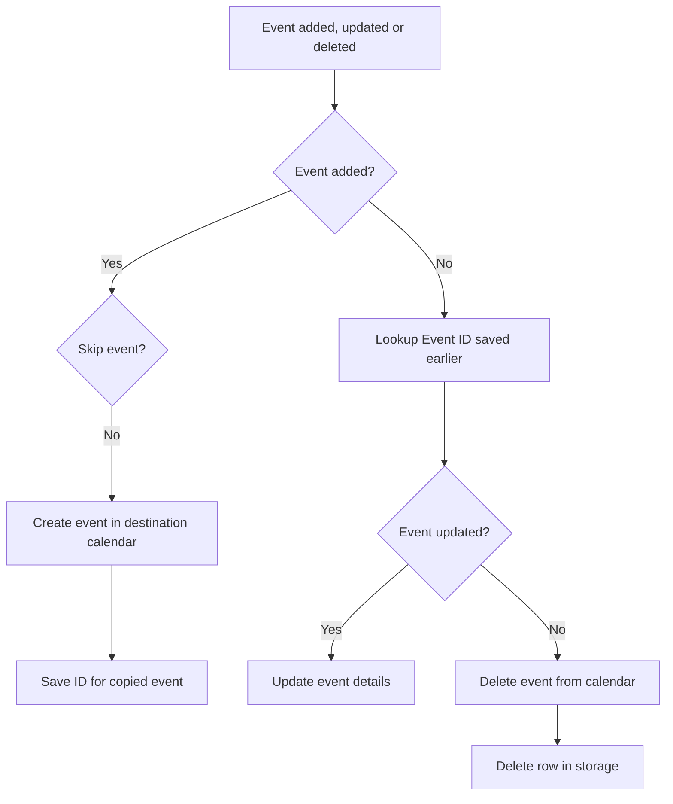

# Event concierge

Sync your calendar to a different tenant with Power Automate.

[Download the solution](https://raw.githubusercontent.com/svrooij/event-concierge/main/dist/Syncyourcalendars_1_0_0_1.zip)

Keeping your calendars in sync as a consultant with two or more Office account can be a challenge. This small flow will automatically copy (some) of the event details to your second (or third) calendar, and update/delete those copied if the original event changes or is deleted.

Be sure to check policies to see if you're allowed to do this, you can also limit the details that get copied and only create basic **"external event"** events in your calendar, so at least your free/busy information is complete for everybody.

## Prerequisites

- Power Automate license (premium not required)
- Two Office 365 accounts (you can also change to sync between your calendar and a [shared one](https://powerusers.microsoft.com/t5/General-Power-Automate/Get-and-create-events-in-a-shared-calendars/td-p/1477629))
- Specific excel file in your OneDrive for business

### Create Excel file

To correlate the original event and the copy I needed some storage and Excel seems like a viable option.

Download [this excel file](https://raw.githubusercontent.com/svrooij/event-concierge/main/event-concierge.xlsx) and place it at the root of your OneDive as `/event-concierge.xlsx`. If placing it in the root folder isn't an option, you'll need to change the actions with the Excel logo to point to the correct location.

This Excel is nothing special, it has one worksheet with a **structured table** on it. This table will be used to save both the original event ID and the event ID of the copy, so we can also process updates.

> To not force a premium license for Power Automate to everybody, I wanted to only use "standard" connectors. If the premium license would not be an issue, I would probably use [Dataverse](https://learn.microsoft.com/en-us/power-apps/maker/data-platform/data-platform-intro) for storage

## Sync Calendar flow

## Updates

This is my first ever flow build in Power Automate, so be kind! It all started with [this tweet](https://twitter.com/svrooij/status/1577362969767432192?s=20&t=MHhpeQy1hfZVlUd1rNPelQ).

If you think this flow helped you out, be sure to let me know on [twitter](https://twitter.com/svrooij) and start following me for updates.

You can also follow my [blog](https://svrooij.io) where I'll be posting more of these awesome flows for Power Automate.
